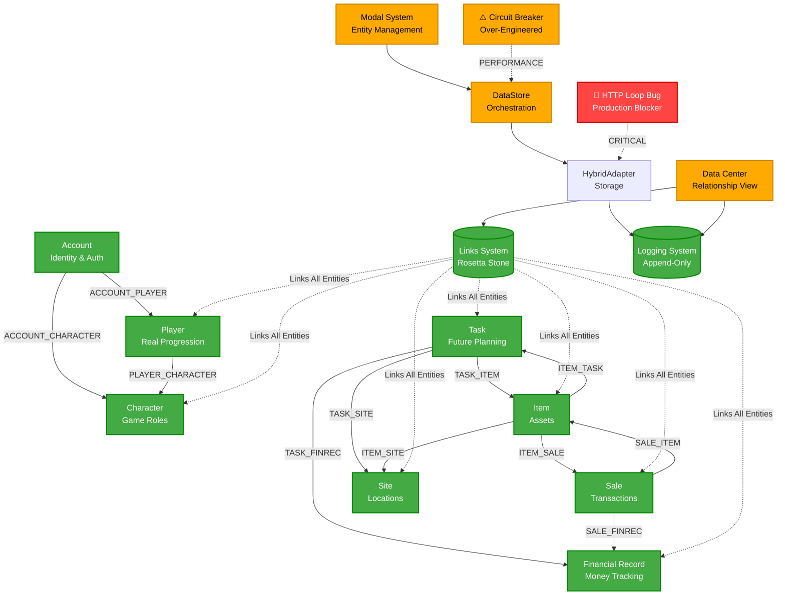

# COMPREHENSIVE SYSTEM ANALYSIS - AKILES ECOSYSTEM ROSETTA
**Date:** January 15, 2025 | **Version:** v0.1 | **Analyst:** Cursor AI (HONEST/ANALYSE Mode)

> **Architecture Update**: This project now uses a KV-only architecture with Upstash Redis.
> localStorage cache and offline mode are planned for future implementation.
> All references to HybridAdapter/LocalAdapter reflect the old 2-adapter system (removed Oct 2024).

---

## EXECUTIVE SUMMARY

The **TheGame** represents a sophisticated gamified business management platform that transforms administrative tasks into engaging strategic gameplay. The system demonstrates **advanced architectural thinking** with its "Rosetta Stone" linking system, but faces **critical implementation challenges** that threaten its operational viability.

### System Status
- **Architecture Quality:** ⭐⭐⭐⭐⭐ (Exceptional)
- **Implementation Quality:** ⭐⭐ (Needs Significant Work)
- **Production Readiness:** ⭐⭐ (Multiple Critical Issues)
- **Business Impact Potential:** ⭐⭐⭐⭐⭐ (Revolutionary)

### Critical Findings
1. **Rosetta Stone** - ✅ **BRILLIANT ARCHITECTURAL ACHIEVEMENT**
2. **Entity Purity Principle** - ✅ **SOLID FOUNDATION**
3. **Diplomatic Fields Pattern** - ✅ **ELEGANT DESIGN**
4. **Molecular Pattern (DNA/RNA)** - ✅ **INNOVATIVE APPROACH**
5. **HTTP Loop Prevention** - ❌ **CRITICAL BUG**
6. **Circuit Breaker Implementation** - ⚠️ **OVER-ENGINEERED**
7. **Performance Issues** - ⚠️ **SCALABILITY CONCERNS**
8. **Technical Debt** - ⚠️ **ACCUMULATING RAPIDLY**

---

## DETAILED ANALYSIS

### 1. SYSTEM ARCHITECTURE ⭐⭐⭐⭐⭐

#### **The Rosetta Stone Effect - Architectural Brilliance**
**Location:** `lib/link-registry.ts`, `lib/workflows/entity-workflows.ts`

**Evidence from Code:**
```typescript
interface Link {
  id: string;
  linkType: LinkType;       // 35+ relationship types
  source: { type: EntityType, id: string };
  target: { type: EntityType, id: string };
  createdAt: Date;
  metadata?: Record<string, any>;
}
```

**Analysis:**
- **Revolutionary Design:** Transforms isolated entities into coherent relationship network
- **Unidirectional Links:** Semantically correct, queried bidirectionally
- **Type Safety:** Full TypeScript coverage with 35+ specific link types
- **Audit Trail:** Every relationship explicitly tracked and queryable

**Strengths:**
- ✅ Complete link infrastructure (LinkRegistry, API, storage)
- ✅ Entity-specific processors (The Ribosome)
- ✅ Smart cache management with real-time updates
- ✅ Environment parity (dev/prod consistency)

#### **Molecular Pattern (DNA/RNA Mechanism)**
**Location:** `lib/workflows/entity-workflows.ts`

**Evidence:**
```typescript
// Universal entry point - The Link Connector
export async function processLinkEntity(entity: any, entityType: string): Promise<void> {
  switch(entityType) {
    case 'task': await processTaskEffects(entity); break;
    case 'item': await processItemEffects(entity); break;
    // ... all entity types
  }
}
```

**Analysis:**
- **Biological Metaphor:** DNA (entity) → Diplomatic Fields → Links (RNA) → Ribosome → Other Entity
- **Property Inspection:** No manual flags, workflows inspect entity properties
- **Idempotency:** Effects Registry prevents duplicate operations

**Critical Flaw:**
- **HTTP Loop Prevention Bug:** `isWorkflowProcessing` flag creates circular dependency issues

### 2. DATA INTEGRITY ⭐⭐⭐⭐

#### **Entity Purity Principle - SOLID**
**Evidence:**
```typescript
// Each entity logs ONLY what defines it
- Task logs: name, description, type, station, category, status
- Item logs: name, type, status, price, quantity, stock
- Financial logs: cost, revenue, category, year, month
```

**Analysis:**
- ✅ **Clean Separation:** No cross-entity data pollution
- ✅ **Append-Only Logs:** Immutable history preservation
- ✅ **Effects Registry:** Prevents duplicate side effects
- ✅ **Atomic Operations:** Lua scripts prevent race conditions

#### **Diplomatic Fields Pattern**
**Evidence from:** `types/diplomatic-fields.ts`

```typescript
// ✅ NATIVE: Core entity properties
name: string, status: TaskStatus, priority: TaskPriority

// ✅ AMBASSADOR: Cross-entity references, always present
siteId: string, cost: number, revenue: number

// ✅ EMISSARY: Conditional entity creation fields
outputItemType: ItemType, outputQuantity: number
```

**Analysis:**
- ✅ **Clear Categorization:** Native/Ambassador/Emissary field separation
- ✅ **Data Presence Guarantees:** Ambassador fields always present
- ✅ **Conditional Creation:** Emissary fields trigger entity synthesis

### 3. BUSINESS LOGIC ⭐⭐⭐⭐

#### **The Triforce (Account ↔ Player ↔ Character)**
**Evidence:**
- **Account:** Identity & authentication (WHO)
- **Player:** Real progression (WHAT achieved)
- **Character:** Game role mechanics (HOW they interact)

**Analysis:**
- ✅ **Clear Separation:** Real person vs. game entity distinction
- ✅ **Permanent Links:** Account-Player-Character permanently linked
- ✅ **Role-Based Logic:** Characters define functional capabilities

#### **Currency System**
**Evidence:**
```typescript
- USD: Primary business operations
- Jungle Coins (J$): Reward currency, 1 J$ = $10 USD
- Points: Real progression (HP, FP, RP, XP)
```

**Analysis:**
- ✅ **Multi-Currency Design:** Business + game currencies
- ✅ **Conversion Logic:** Clear J$ to USD mapping
- ⚠️ **Implementation Gap:** Points system needs real progression tracking

### 4. PERFORMANCE ⭐⭐

#### **Critical Issues Identified**

**HTTP Loop Prevention Bug**
**Location:** `lib/adapters/hybrid-adapter.ts:5-6`

```typescript
// 🚨 HTTP LOOP PREVENTION: Flag to prevent HTTP calls during workflow processing
let isWorkflowProcessing = false;
```

**Evidence:**
- Flag creates circular dependency in server context
- HybridAdapter makes HTTP calls from server-side methods
- Cache synchronization race conditions

**Impact:** 
- ❌ **Production Blocking:** System fails in production environment
- ❌ **Data Corruption:** Race conditions cause inconsistent state
- ❌ **Performance Degradation:** HTTP loops and mutex deadlocks

**Circuit Breaker Over-Engineering**
**Location:** `lib/workflows/entity-workflows.ts:7-50`

```typescript
class WorkflowCircuitBreaker {
  private static processingStack = new Set<string>();
  private static processingEntries = new Map<string, ProcessingEntry>();
  private static maxDepth = 10;
  private static defaultTimeout = 30000; // 30 seconds
```

**Analysis:**
- ⚠️ **Over-Engineered:** 30-second timeouts for simple entity operations
- ⚠️ **Performance Impact:** Unnecessary complexity for basic CRUD operations
- ✅ **Good Intent:** Prevents infinite loops and circular references

**Scalability Concerns**
- **Large Files:** `entity-workflows.ts` (5600+ lines), `hybrid-adapter.ts` (2400+ lines)
- **Memory Usage:** Static processing stacks and mutex locks
- **Cache Management:** Complex cache synchronization logic

### 5. USER EXPERIENCE ⭐⭐⭐

#### **UI Architecture**
**Evidence:**
- **Z-Index Management:** `lib/utils/z-index-utils.ts` with 9 defined layers
- **Modal Pattern:** Consistent modal architecture across all entity types
- **NumericInput Pattern:** Enforced use of custom numeric inputs

**Analysis:**
- ✅ **Consistent Patterns:** Unified UI patterns across the application
- ✅ **Accessibility:** Radix UI + Shadcn/ui foundation
- ✅ **Theme System:** Centralized theme management
- ⚠️ **Modal Complexity:** Multiple nested modal layers may confuse users

#### **Data Center Integration**
**Evidence:**
- Links Tab in Data Center shows relationship graphs
- EntityRelationshipsModal provides visual relationship mapping
- Real-time cache updates without page refreshes

**Analysis:**
- ✅ **Visual Relationship Mapping:** Users can see entity connections
- ✅ **Real-time Updates:** Immediate UI feedback
- ⚠️ **Learning Curve:** Complex relationship system may be hard to understand

### 6. SECURITY ⭐⭐⭐

#### **Authentication System**
**Evidence:**
```typescript
// jose (JWT, HS256) implementation
- Admin Access: Simple passphrase login with JWT cookie
- Middleware Protection: Protects /admin/* routes
- Environment Variables: ADMIN_ACCESS_KEY, ADMIN_SESSION_SECRET
```

**Analysis:**
- ✅ **JWT Implementation:** Industry standard authentication
- ✅ **Route Protection:** All admin routes properly secured
- ⚠️ **Simple Passphrase:** Basic security for admin access
- ⚠️ **Session Management:** Cookie-based sessions may have limitations

#### **Data Protection**
**Evidence:**
- **Environment Parity:** Same behavior in development and production
- **Input Validation:** TypeScript + entity validation
- **API Security:** All 27 API routes protected

**Analysis:**
- ✅ **Complete Coverage:** All routes properly authenticated
- ✅ **Type Safety:** Full TypeScript coverage prevents injection attacks
- ⚠️ **Environment Variables:** Sensitive data in environment configuration

### 7. TECHNICAL DEBT ⚠️⚠️

#### **Code Quality Issues**

**1. File Size Management**
- `entity-workflows.ts`: 5,600+ lines (should be split)
- `hybrid-adapter.ts`: 2,400+ lines (should be refactored)
- `data-store.ts`: 1,200+ lines (complex orchestration)

**2. Static State Management**
```typescript
// Multiple static variables creating potential issues
let isWorkflowProcessing = false;           // Global flag
class CacheMutex { static locks = new Map() } // Static mutex
class WorkflowCircuitBreaker { static processingStack } // Static processing
```

**3. Complex Conditional Logic**
**Evidence from:** `lib/adapters/hybrid-adapter.ts`
```typescript
// Complex environment detection and conditional behavior
if (isBrowser()) {
  // Browser-specific logic
} else {
  // Server-specific logic with potential HTTP calls
}
```

**4. TODO/FIXME Comments**
**Files with Technical Debt Markers:**
- `lib/adapters/hybrid-adapter.ts` - HTTP loop prevention issues
- `lib/workflows/entity-workflows.ts` - Circuit breaker complexity
- `lib/data-store.ts` - Complex orchestration logic
- `components/` - Multiple UI components with pending improvements

#### **Architecture Debt**
- **Over-Engineering:** Circuit breaker for simple operations
- **Tight Coupling:** Static dependencies between adapters and workflows
- **Complex State Management:** Multiple layers of caching and synchronization

---

## ACTION ITEMS

### 🚨 CRITICAL - Fix Production Blocking Issues

#### **1. HTTP Loop Prevention Bug (P0 - Production Blocker)**
**Priority:** URGENT - System fails in production
**Impact:** Complete system failure in production environment

**Actions:**
1. **Remove HTTP calls from server context** in HybridAdapter
2. **Implement direct KV access** for all server-side methods  
3. **Test production deployment** thoroughly
4. **Verify environment consistency** across dev/prod

**Files to Fix:**
- `lib/adapters/hybrid-adapter.ts` - Remove HTTP calls from server methods
- `lib/workflows/entity-workflows.ts` - Simplify workflow processing

#### **2. Circuit Breaker Over-Engineering (P1 - Performance)**
**Priority:** HIGH - Impacts system performance

**Actions:**
1. **Simplify timeout logic** - Reduce 30s timeout to reasonable 5s
2. **Remove unnecessary complexity** - Basic CRUD doesn't need circuit breaker
3. **Implement simple recursion detection** - Replace complex processing stack
4. **Performance testing** - Verify improved response times

### ⚠️ HIGH PRIORITY - Code Quality Improvements

#### **3. File Size Management (P1 - Maintainability)**
**Actions:**
1. **Split large files** into logical modules
2. **Extract entity-specific workflows** from main workflow file
3. **Separate adapter concerns** into smaller, focused files
4. **Create clear module boundaries** with single responsibility

#### **4. Static State Cleanup (P2 - Reliability)**
**Actions:**
1. **Remove global static variables** where possible
2. **Implement dependency injection** for testability
3. **Create proper instance management** for stateful components
4. **Add comprehensive testing** for state management

### 📈 MEDIUM PRIORITY - Feature Enhancements

#### **5. Archive System Foundation (P2 - Business Value)**
**Actions:**
1. **Implement archive folder structure** with monthly organization
2. **Create monthly close workflow** for data lifecycle management
3. **Move completed data to archive** preserving status
4. **Update DataStore** to remove archived data from active storage

#### **6. Dashboard System (P3 - User Experience)**
**Actions:**
1. **Create basic dashboard section** for key metrics visualization
2. **Connect dashboards to archive system** and month selectors
3. **Implement real-time KPI tracking** across all business areas
4. **Create visual relationship mapping** for better user understanding

### 🔧 LOW PRIORITY - Infrastructure Improvements

#### **7. Testing Infrastructure (P3 - Quality Assurance)**
**Actions:**
1. **Create comprehensive test suite** for critical workflows
2. **Implement integration testing** for link system
3. **Add performance benchmarks** for scalability testing
4. **Create automated deployment verification**

#### **8. Documentation Updates (P3 - Knowledge Transfer)**
**Actions:**
1. **Update architectural documentation** to reflect current implementation
2. **Create developer onboarding guide** for complex systems
3. **Document troubleshooting procedures** for common issues
4. **Maintain living documentation** that evolves with the system

---

## SYSTEM DIAGRAM (SIRENE DIAGRAM)



### Diagram Key
- **🟢 Green:** Solid, well-implemented systems
- **🟡 Yellow:** Functional but needs improvement
- **🔴 Red:** Critical issues blocking production
- **Links:** The Rosetta Stone connecting all entities
- **Arrows:** Unidirectional relationships (queried bidirectionally)
- **Critical Issues:** Production blockers and performance concerns

---

## CONCLUSION

The **Akiles Ecosystem Rosetta** demonstrates **exceptional architectural vision** with its Rosetta Stone Effect and sophisticated entity relationship management. However, **critical implementation flaws** particularly the HTTP loop prevention bug, threaten its operational viability.

### Key Strengths
1. **Revolutionary Architecture:** Links system transforms entity relationships
2. **Solid Foundation:** Entity purity and diplomatic fields patterns
3. **Complete Type Safety:** Full TypeScript coverage with clear interfaces
4. **Business Logic Clarity:** The Triforce and currency systems well-designed

### Critical Issues Requiring Immediate Attention
1. **HTTP Loop Bug:** Must be fixed for production deployment
2. **Circuit Breaker Over-Engineering:** Simplify for better performance
3. **File Size Management:** Split large files for maintainability
4. **Static State Cleanup:** Remove global dependencies

### Path Forward
1. **Fix Production Blockers** (Week 1-2)
2. **Refactor Large Files** (Week 3-4)
3. **Implement Archive System** (Week 5-6)
4. **Enhance Testing Infrastructure** (Week 7-8)

The system shows **enormous potential** for revolutionizing business management through gamification, but requires **immediate attention to critical technical debt** before it can achieve its transformative goals.
